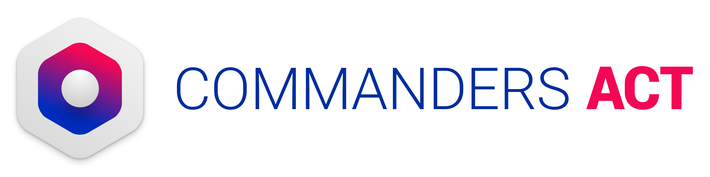

# TCServerSide Flutter plugin

Commanders Act's TCServerSide mobile lib

## Getting Started

If you encounter any issues or have any feedback, please report them to us so that we can improve the software for future releases.

It is important to have a look on both [Android](https://github.com/CommandersAct/AndroidV5/tree/master/TCServerSide) and [IOS](https://github.com/CommandersAct/iosv5/tree/master/TCServerSide) documentation to understand the basic functionning of the library. 

## Installation 

We'll be releasing this plugin on pub.dev later but for now, you'll need to set a git dependency. 

On your pubspec.yaml, set : 
replace `*.*.*` by the number of the latest version available here : [Releases](https://github.com/CommandersAct/tcserverside-flutter-plugin/releases)

```
dependencies:

  tc_serverside_plugin:
    git:
      url: https://github.com/CommandersAct/tcserverside-plugin.git
      ref: *.*.*
```

Use `-idfa` releases if you need IDFA in your ios hits.

```
dependencies:

  tc_serverside_plugin:
    git:
      url: https://github.com/CommandersAct/tcserverside-plugin.git
      ref: *.*.*-idfa
```
### Proguard setup for android ⚠️ : 

To prevent any unexpected issues, please make sure to configure Proguard correctly according to the guidelines provided in the original documentation.

https://github.com/CommandersAct/AndroidV5/tree/master/TCCore#using-proguard.

## Usage : 

Simillar to Android and iOS SDKs, you'll need to create a ServerSide() instance and initialise it with your personal `siteID` and `source_key`.

As for TCDevice and other classes, porting them is currently in development, this repo will be updated as soon as possible.

Please have a look on `lib/tc_serverside.dart`  & `example/lib/main.dart` for more info. 

An example code will look like : 

```
  TCDebug().setDebugLevel(TCLogLevel.TCLogLevel_Verbose);// optional but recommended to enable logs
  TCServerside serverside = TCServerside();
  serverside.initServerSide(3311, "sourceKey");
  serverside.execute(TCPageViewEvent());
```

## Firebase Destination : 

If you need to forward your events to firebase, please check the following documentation : 

[See the detailed guide](./res/firebase_events_forward.md)

## Demo App : 

A full example of a flutter application that implements the bridge is available in the following repository : 

https://github.com/CommandersAct/TCMobileDemo-flutter.


# Support & Contact : 

Support : support@commandersact.com

http://www.commandersact.com

Commanders Act | 7b rue taylor - 75010 PARIS - France


